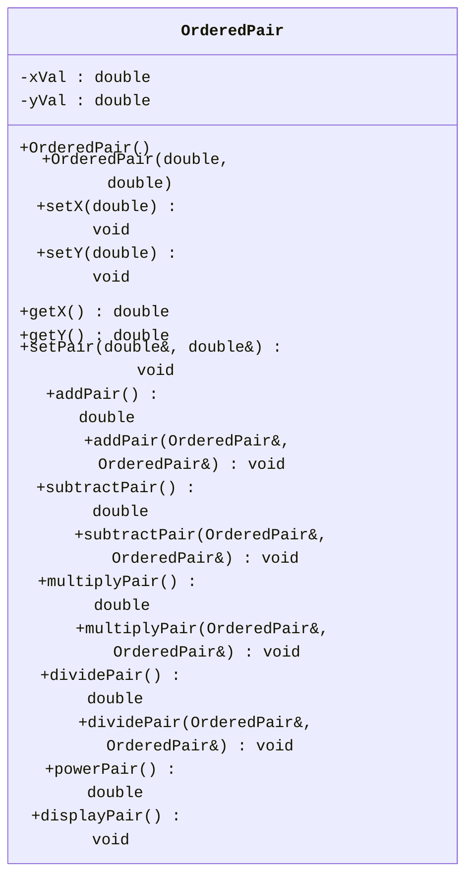

[](https://classroom.github.com/a/dD679PlH)
[](https://classroom.github.com/open-in-codespaces?assignment_repo_id=15934092)
<link rel="stylesheet" href="https://cdnjs.cloudflare.com/ajax/libs/font-awesome/6.0.0-beta3/css/all.min.css">

# Programming Assignment #4 (PA4)

## Overview

In this assignment, we take a look at function overloading and the array data structure

<div
    style="background-color: #FFFBEB; border-left: 6px solid #F97316; color: #813F0B; padding: 10px; border-radius: 5px;">
    <i class="fa-solid fa-triangle-exclamation" style="margin-right: 10px;"></i>
    <b style="display: inline; margin-bottom: 8px; font-size: 16px;">Naming Conventions:</b>
    <p><ul>
<li>While implementation details are still up to you, make sure you use the coding style discussed in class regarding functions, name, classes, and indentations unless a specific name is given to you throughout this assignment.</li>
<li>If a specific name for something like a <code>variable</code>, <code>class</code>, or <code>function</code> is given to you, you <em>MUST</em> use it exactly or the autograder won&#39;t be able to find it and the tests will fail.<ul>
<li>This applies to function prototypes/signatures/definitions as well. The <code>inputs</code> and <code>outputs</code> of the functions you implement must also match the ones specified.</li>
<li>Points will <em><em>not</em></em> be given for tests that fail due to incorrect naming or signature mismatch.</li>
</ul>
</li>
<li>Variables should be localized with the correct scope, datatype (based on the data needed to be stored), and their names must be pneumonic. I.e., avoid variables like a, b, i, j, k, x, y, z, etc. </li>
<li>Coding style will be reviewed and your assessment grade may be impacted due to that as described in our syllabus.</li>
<li>Remember that homework must be completed <strong>individually</strong> without help (human or AI).</li>
</ul></p>
</div>

<br>

<!-- Restrictions on what libraries are/aren't allowed to be used -->
<div
    style="background-color: #FEF2F2; border-left: 6px solid #EF4444; color: #991B1B; padding: 16px; border-radius: 5px;">
    <i class="fa-solid fa-fire-flame-curved" style="margin-right: 10px;"></i>
    <b style="display: inline; margin-bottom: 8px; font-size: 16px;">Restrictions:</b>
    <p><ul>
<li>Only the libraries discussed in class can be used in homework:<ul>
<li><code>iostream</code></li>
<li><code>string</code></li>
<li><code>cmath</code></li>
<li><code>array</code></li>
<li><code>random</code></li>
<li><code>cstddef</code></li>
<li><code>ctime</code></li>
<li><code>iomanip</code></li>
</ul>
</li>
<li>The <code>using namespace</code> statement such as <code>using namespace std;</code> is <strong>not allowed</strong> in this homework. The <code>using</code> keyword is otherwise allowed, e.g., <code>using std::cout;</code>.</li>
</ul></p>
<p>You may lose a significant number of points for not following these restrictions!</p>
</div>

## Tasks & TODOs

<!-- Note (Blue) -->
<div
    style="background-color: #E5F6FF; border-left: 6px solid #2CA5E0; color: #091E42; padding: 16px; border-radius: 5px; font-family: Arial, sans-serif; font-size: 14px;">
    <i class="fa-solid fa-circle-info"></i>
    <b style="display: inline; margin-bottom: 8px; font-size: 16px;">Note:</b>
    <p>There are no TODO comments for this assignment as you are creating your own files. You can use the TODOs from prior PAs as a rough guide to the pieces you need. You should also refer to your class notes and textbook for guidance as necessary.</p>
</div>

<br>

## Part 1 - Ordered Pair Class

1. In the `src` directory, create `.cpp` and `.h` files for the `OrderedPair` class.
  - the `.h` file must contain only the function declarations (prototypes).
    - Your header file should start (other than comments) with the lines:
      - `#ifndef ORDEREDPAIR_H`
      - `#define ORDEREDPAIR_H`
    - The very last line in the file will be:
      - `#endif`
    - You will learn more about why these are needed later on. For now, it is enough to know you need to include them in your header file to stop bad things from happening.
  - the `.cpp` file must contain the implementation of the class functions.
  - Don't forget everything in C++ is case-sensitive. This includes file names.
    - Files storing Class information should be capitalized as are their classes.
2. The `OrderedPair` class:
   - **Member Variables**
      - a `double` to hold the $x$ value of an coordinate pair: `xVal`
      - a `double` to hold the $y$ value of an coordinate pair: `yVal`
   - **Constructors**
      - a default constructor that takes no parameters.
      - a fully parameterized constructor that takes in an $x$ and $y$ value for `xVal` and `yVal` respectively
   - **Standard Functions**
      - Standard Getters: `getX()`, `getY()`
      - Standard Setters: `setX(double)`, `setY(double)`
   - **Element-wise Arithmetic Functions**
      - `addPair()` will return a `double` of the sum of `xVal` and `yVal`
      - `subtractPair()` will return a `double` of the subtraction of `yVal` from `xVal`
      - `multiplyPair()` will return a `double` of the multiplication of `xVal` and `yVal`
      - `dividePair()` will return a `double` of the division of `xVal` by `yVal`. Include an error check for dividing by zero, and in that case, print `yVal==0` to the terminal
      - `powerPair()` will return a `double` of `xVal` to the power of `yVal`
   - **Pair-wise Arithmetic Functions**
      - **ALL OF THE PAIR-WISE FUNCTIONS ARE PASS BY REFERENCE**
      - `addPair(OrderedPair&, OrderedPair&)` will replace the target object's `xVal` with the sum of the $x$ values of the ordered pair parameters and `yVal` to the sum of the $y$ values of the ordered pair parameters
      - `subtractPair(OrderedPair&, OrderedPair&)` will replace the target object's `xVal` with the subtraction ($x_1 - x_2$) of the $x$ values of the ordered pair parameters and `yVal` with the subtraction of the $y$ values of the ordered pair parameters
      - `multiplyPair(OrderedPair&, OrderedPair&)` will replace the target object's `xVal` with the multiplication of the $x$ values of the ordered pair parameters and `yVal` with the multiplication of the $y$ values of the ordered pair parameters
      - `dividePair(OrderedPair&, OrderedPair&)` will replace the target object's `xVal` with the division ($x_1 / x_2$) of the $x$ values of the ordered pair parameters and `yVal` with the division of the $y$ values of the ordered pair parameters. Include an error check for dividing by zero, and in that case, print `DIVIDE BY ZERO` to the terminal
   - **Other Functions**
      - `displayPair()` displays the ordered pair in the format (xVal, yVal), for example: (1, 2). End on a newline. `displayPair()` wants 6 decimal places. *Hint: to_string() formats to 6 decimal places by default*


### `OrderedPair` UML Diagram.



<!-- Note (Blue) -->
<div
    style="background-color: #E5F6FF; border-left: 6px solid #2CA5E0; color: #091E42; padding: 16px; border-radius: 5px; font-family: Arial, sans-serif; font-size: 14px;">
    <i class="fa-solid fa-circle-info"></i>
    <b style="display: inline; margin-bottom: 8px; font-size: 16px;">Note:</b>
    <p>Make sure you put the declarations in the header file and the implementations in the .cpp file!</p>
</div>
<br>


---

## Part 2: Array and Statistics Functions

You will create a series of functions to calculate the average (mean), max/min, and standard deviation of student grades. In these functions, every parameter will be [pass-by-reference](https://www.ibm.com/docs/en/zos/2.4.0?topic=calls-pass-by-reference-c-only). The functions will take user input, perform the necessary calculations or searches, and display the information in a readable format.

1. In the `src` directory, create `functions.cpp` and `functions.h` files
  - the `.h` file must contain only the declaration (prototypes).
  - the `.cpp` file must contain the implementation of the functions.
  - **You will not be using a class for this part**
  - Don't forget everything in C++ is case-sensitive. This includes file names.
2. Functions in `functions`
  - `getInput(array<float, MAX_SIZE>& )`
    - Will receive an empty `array` of floats passed by reference, with `MAX_SIZE` = 50. It will then take user input until a -1 is received, or the array fully populates. Returns an `int` of the array length
  - `randInput(array<float, MAX_SIZE>&, int&)`
    - Will receive an empty `array` of floats passed by reference to be populated with random values, with `MAX_SIZE` = 50, and an `int` passed by reference, which is a number between 1 and 50 of random values to generate. If the value is less than 1 or more than 50, the function will terminate without any values being added to the array. The random values must be between 1 and 100. You must use the [`srand()`](https://en.cppreference.com/w/cpp/numeric/random/srand) method in this function to seed the random values. This function will not return anything
  - `average(array<float, MAX_SIZE>&, int&)`
    - Will receive a populated `array` of floats passed by reference, and an `int` of the array length passed by reference. It will then calculate the average and return it as a `float`
  - `maxAndMin(array<float, MAX_SIZE>&, int&, float& max, float& min)`
    - Will receive a populated `array` of floats passed by reference, an `int` of the array length passed by reference, and two `float` values, max and min, passed by reference. It will then find the maximum and minimum values of the array, and store them in their respective variables. This function will not return anything
  - `standardDev(array<float, MAX_SIZE>&, int&)`
    - Will receive a populated `array` of floats passed by reference, and an `int` of the array length passed by reference. It will calculate the standard deviation and return it as a `float`
    - Equation for standard deviation:
    - 
  - `display(array<float, MAX_SIZE>&, int&)`
    - Will receive a populated `array` of floats passed by reference, and an `int` of the array length passed by reference. It will then output the number of grades, the list of grades 5 per line with each value delimited by a space, the average, the maximum value, the minimum value, and the standard deviaton. All of the information must be retrieved and calculated with the other functions.  
    Example output:
    ```
    6 grades were entered
    The values are:
    100 90 80 70 60
    50
    The average of the 6 numbers is : 75.0
    The minimum number is : 50
    The maximum number is : 100
    The standard deviation is : 18.708

    ```


<br>


3. Create a `main.cpp` file with an `int main()`and use it to test your `OrderedPair` methods. To test the functions, create an empty array of the correct length in main to pass as an argument. `main.cpp` must demonstrate testing of both the `userInput()` and `randInput()` functions with different arrays.

<!-- Important (Yellow) -->
<div
    style="background-color: #FEF9C3; border-left: 6px solid #F59E0B; color: #854D0E; padding: 16px;  border-radius: 5px;">
    <i class="fa-solid fa-exclamation" style="margin-right: 10px;"></i>
    <b style="display: inline; margin-bottom: 8px; font-size: 16px;">Important!</b>
    <p>Failure to complete this step may result in a loss of points!</p>
</div>


## Testing

Your code will run against unit tests on an Autograder. The Autograder runs on Ubuntu Linux so the unit tests are configured for that OS only. You can run the tests in a Codespace (which uses Ubuntu as well) or on your own Ubuntu environment (if you have one) using the provided `g++` instructions. Remember tests must pass on the Autograder to receive points.

### Compiling

It is expected that you are able to compile and run your own code without relying solely on other tools. This includes the VS Code Debugger's "Play/Run" Button. You should not be using that at all for this assignment. Here is the general format for g++ (you leave out the `[]` characters when actually writing the commands ):

```bash
g++ [relevant setting and flags. These usually start with a '-'] [list of files to link together separated by a space : .cpp, .o, .a etc] -lpthread -o [name of the output file you wish to use]
```

The `g++` build command does use a couple extra settings when compiling with the unit tests. The additional options and what they signify are explained here:


- `[.cpp files, .o files, and .a files]` : Now, list off any .cpp source files, .o object files, and .a static library files that need to be included in the build. For all of these, you must include the relative file path for any files that aren't in your current working directory.
    - You will first list off any `.cpp` files needed by your program to run. In general, if your code uses an `#include "*.h"` statement, you will put the corresponding `.cpp` file here.
    - Then, add the object file for the test(s) you wish to run. Remember you must also include the relative file path if you are in a different working directory from the .o file (for example, `../tests/` if you are in the `src` folder or just `tests/` if you at the root of the repo).
    - Lastly, include the file `gtest_main.a`. This file contains the `main` program needed to launch the unit tests against your code.
        - Remember: A build must include **_exactly one (1)_** main function so you can't include your own main when running the unit tests.

- `-lpthread`: Links the pthread library to the resulting executable. In essence, it ensures that threading functions are available in the resulting binary. The unit tests use multithreading which is why we are including it.

- `-o` : This option lets you specify the name of the file you want `g++` to output the executable code. If a file with that name already exists, *it will be overwritten*. The default output file is `a.out` if you don't include this option.

Here is an example of a build command that could be used for this assignment. In this example, the working directory is `repository root` or top level of the repository:

```bash
g++ src/OrderedPair.cpp tests/gtest_main.a tests/standardDev_test.o -lpthread -o standardDev_test.exe
```

Modify it as needed to run the tests as you wish. The autograder will also still run on each push to your repo if you prefer to test that way.

<div
    style="background-color: #FFFBEB; border-left: 6px solid #F97316; color: #813F0B; padding: 16px; border-radius: 5px;">
    <i class="fa-solid fa-triangle-exclamation" style="margin-right: 10px;"></i>
    <b style="display: inline; margin-bottom: 8px; font-size: 16px;">Caution</b>
    <p>Do <b>not</b> attempt to force the unit tests to pass by hardcoding in responses to expected values. Attempts to bypass or "trick" the Autograder are considered academic misconduct and may result in a 0 for the whole assignment.</p>
</div>

## Rubric & Grading

Here is the breakdown of the tests, what they test, and how many points they are worth.

### Ordered Pair Rubric

| Test Name                  | Description                                       | points |
| -------------------------- | ------------------------------------------------- | ----: |
| getters_test               | Verifies the getters for the `OrderedPair` class      |     2 |
| setters_test               | Verifies the setters for the `OrderedPair` class      |     2 |
| addPairElement_test        | Verifies element-wise `addPair`                       |     4 |
| addPairOrdered_test        | Verifies pair-wise `addPair`                     |     4 |
| subtractPairElement_test   | Verifies element-wise `subtractPair`             |     4 |
| subtractPairOrdered_test   | Verifies pair-wise `subtractPair`                |     4 |
| multiplyPairElement_test   | Verifies element-wise `multiplyPair`             |     4 |
| multiplyPairOrdered_test   | Verifies pair-wise `multiplyPair`                |     4 |
| dividePairElement_test     | Verifies element-wise `dividePair`               |     4 |
| dividePairOrdered_test     | Verifies pair-wise `dividePair`                  |     4 |
| powerPair_test             | Verifies `powerPair` is implemented properly     |     2 |
| displayPair_test             | Verifies `displayPair` prints the ordered pair in the proper output |     2 |

---

### Functions Rubric

| Test Name                  | Description                                       | points |
| -------------------------- | ------------------------------------------------- | ----: |
| getInput_test              | Verifies if `getInput` takes in values and adds them to the array |     6 |
| getRand_test              | Verifies if `getRand` populates the array with a given number of random values |     10 |
| average_test              | Verifies if `average` properly calculates the average |     6 |
| maxAndMin_test              | Verifies if `maxAndMin` retrieves the max and min value |     6 |
| standardDev_test              | Verifies if `standardDev` properly calculates the standard deviation |     6 |
| display_test              | Verifies if `display` outputs the information in the proper format |     6 |


<div
    style="background-color: #E5F6FF; border-left: 6px solid #2CA5E0; color: #091E42; padding: 10px; border-radius: 5px;">
    <i class="fa-solid fa-circle-info"></i>
    <b style="display: inline; margin-bottom: 8px; font-size: 16px;">Grading Breakdown & Style Points</b>
    <p>Assignments on Canvas will be recorded out of 100 points.</p>
    <p>The grading of homework is a combination of completeness and correctness of the outputs and programming style.
Completeness and correctness (80 points) will be assessed automatically through testing on GitHub Classroom,
while instructors and TAs will assess the programming style after the deadline (20 points).</p>
    <p>Code style will be evaluated using the guidelines shown in the Modules on Canvas.</p>
    <p>This grading will be done manually by the TAs after the deadline.</p>
</div>
<br>
<!-- Important (Yellow) -->
<div
    style="background-color: #FEF9C3; border-left: 6px solid #F59E0B; color: #854D0E; padding: 16px;  border-radius: 5px;">
    <i class="fa-solid fa-exclamation" style="margin-right: 10px;"></i>
    <b style="display: inline; margin-bottom: 8px; font-size: 16px;">Important Note Regarding the Rubric</b>
    <p>This Rubric is a breakdown of the test cases and their points only!</p>
    <p>You must also review the Rubric on the Canvas Assignment for the rest of the grading criteria.</p>
</div>
